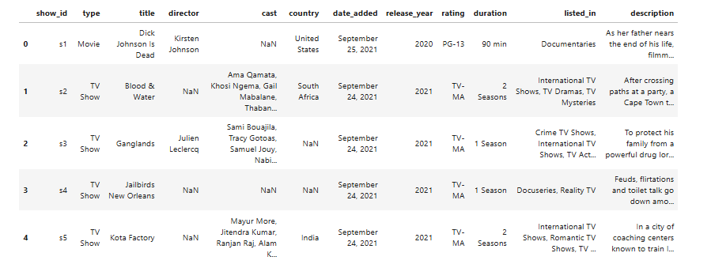

[12:47 PM, 4/29/2026] 👼🏻: # ==========================================
# NETFLIX CONTENT ANALYSIS PROJECT
# Angel Daher
# ==========================================

import os
import glob
import pandas as pd
import matplotlib.pyplot as plt

# 1. Automatically find CSV file
csv_files = glob.glob("/kaggle/input/*/.csv", recursive=True)

print("CSV files found:")
for file in csv_files:
    print(file)

# Load the first CSV found
file_path = csv_files[0]
df = pd.read_csv(file_path)

print("\nDataset loaded successfully!")
print("File used:", file_path)

# 2. Project Objective
print("\n=== PROJECT OBJECTIVE ===")
print("In this project, I explore Netflix content to understand how movies and TV shows are distributed over time and across countries.")

# 3. Dataset Preview
print("\n=== DATASET PREVIEW ===")
display(df.head())

# 4. Basic Dataset Info
print("\n=== DATASET INFORMATION ===")
print("Rows:", df.shape[0])
print("Columns:", df.shape[1])
print("\nColumn names:")
print(df.columns)

# 5. Basic Cleaning
df = df.dropna(subset=["type", "release_year"])

# 6. Basic Analysis
print("\n=== BASIC ANALYSIS ===")

type_counts = df["type"].value_counts()

movies_count = type_counts.get("Movie", 0)
tvshows_count = type_counts.get("TV Show", 0)

print("Movies:", movies_count)
print("TV Shows:", tvshows_count)

if movies_count > tvshows_count:
    print("Observation: Netflix contains more movies than TV shows in this dataset.")
else:
    print("Observation: Netflix contains more TV shows than movies in this dataset.")

# 7. Graph: Movies vs TV Shows
plt.figure(figsize=(6,4))
df["type"].value_counts().plot(kind="bar")
plt.title("Distribution of Movies vs TV Shows on Netflix")
plt.xlabel("Content Type")
plt.ylabel("Number of Titles")
plt.xticks(rotation=0)
plt.show()

# 8. Content Over Time
print("\n=== CONTENT OVER TIME ===")

content_by_year = df["release_year"].value_counts().sort_index()

display(content_by_year.tail(10))

plt.figure(figsize=(8,4))
content_by_year.plot(kind="line")
plt.title("Netflix Content Release Over Time")
plt.xlabel("Release Year")
plt.ylabel("Number of Titles")
plt.show()

# 9. Top Countries
print("\n=== TOP COUNTRIES ===")

country_data = df.dropna(subset=["country"])
top_countries = country_data["country"].value_counts().head(10)

display(top_countries)

plt.figure(figsize=(8,4))
top_countries.plot(kind="bar")
plt.title("Top 10 Countries by Netflix Content")
plt.xlabel("Country")
plt.ylabel("Number of Titles")
plt.xticks(rotation=45)
plt.show()

# 10. Final Interpretation
print("\n=== FINAL INTERPRETATION ===")

print("The dataset shows that Netflix contains more movies than TV shows.")
print("The number of released titles increased strongly in recent years, reflecting the growth of streaming platforms.")
print("The United States appears as one of the leading content-producing countries in the Netflix catalog.")
print("This project demonstrates basic data cleaning, exploratory analysis, visualization, and interpretation using Python.")
[1:01 PM, 4/29/2026] 👼🏻: # Netflix Content Analysis

## Objective
Analyze Netflix content to understand the distribution of movies and TV shows, content growth over time, and leading content-producing countries.

## Tools
- Python
- Pandas
- Matplotlib
- Kaggle Notebook

## Key Analysis
- Compared Movies vs TV Shows
- Analyzed content release over time
- Identified top countries by Netflix content

## Insights
- Netflix contains more movies than TV shows.
- Content production increased significantly in recent years.
- The United States appears among the leading content-producing countries.

## Screenshots
### Dataset Preview

### Movies vs TV Shows

### Content Over Time

